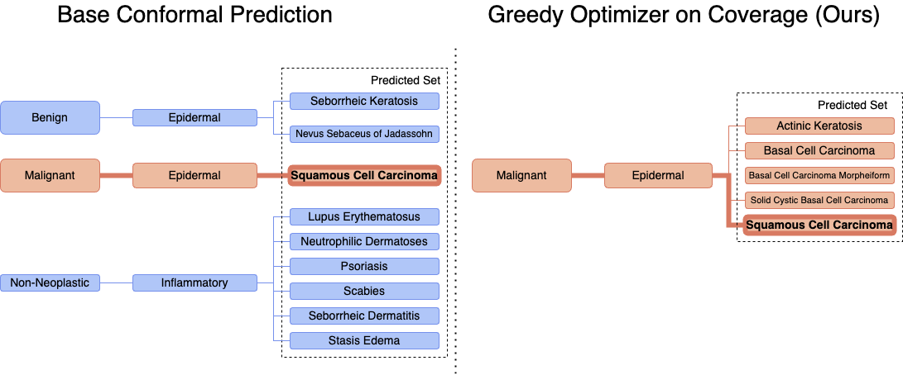

# Utility-Driven Conformal Prediction

[](https://arxiv.org/abs/2410.01767)

**Authors: Santiago Cortes-Gomez, Carlos Miguel Patiño, Yewon Byun, Steven Wu, Eric Horvitz, Bryan Wilder**

This repository contains the code for the Utility-Driven Conformal Prediction paper published at ICLR 2025. We provide all the necessary code to reproduce the experiments in the paper.



## Download Artifacts

Our method builds on top of predictions from a neural network that predicts the softmax scores for an image. We provide the predictions and all the artifacts to run our method in a [Hugging Face dataset](https://huggingface.co/datasets/cmpatino/utility_driven_prediction). You can download all the artifacts by running

```bash
python download_artifacts.py
```

This will download the `utility_input_artifacts` and the `hierarchy_artifacts` directories that contain the necessary files to run our method.

## Running the Experiments

To run the experiments, you can use the main.py script specifying the configuration through a configuration file. We provide the configuration files for all the experiments in the `configs` directory. For example, to replicate the results on the Fitzpatrick dataset you can run

```bash
python main.py configs/fitzpatrick.json --log_parquet
```

While reproducing the results, keep in mind of the runtimes of the experiments as some of them can take a long time to run. The order of magnitude using a machine with 8 CPU cores are:
1. Fitzpatrick + Fitzpatrick Clean (`fitzpatrick.json`): < 10 min
2. iNaturalist (`inaturalist.json`): ~ 1 hour
3. CIFAR-100 (`cifar.json`): ~ 1 hour
4. ImageNet (`imagenet.json`): ~ 12 hours

### Parameters
* `probabilities_ids`: List of directories in the `utility_input_artifacts` directory that contain the softmax scores and other required artifacts.
* `lambdas`: List of lambdas to evaluate for the methods that require it. Recall that lambda is a hyperparameter that controls the influence of the utility term in the conformal prediction method.
* `alphas`: Target statistical coverage.
* `loss_functions`: List of methods to evaluate corresponding to the methods in the paper. The available methods are:
  * Cumulative: Penalized Conformal on a separable loss function.
  * NeymanPearson: Separable Penalized Ratio.
  * MarginalMax: Penalized Conformal on a non-separable loss function.
  * GreedyMax: Greedy Optimizer on Max.
  * GreedyCoverageFunction: Greedy Optimizer on Coverage.

## Reproducing Tables and Plots

If you run the code on the previous section, you will generate a parquet file with the results of the experiments. To reproduce the tables and plots in the paper, you can use the scripts available in the `plotting` directory.

## Training Classifiers

For full reproducibility of our results, we also provide the code we used to train the classifiers for each dataset in the `classifier_training` directory.

### Datasets

We used the following datasets to train the classifiers:
* [Fitzpatrick](https://github.com/mattgroh/fitzpatrick17k?tab=readme-ov-file)
* iNaturalist
* CIFAR-100
* ImageNet

The iNaturalist, CIFAR-100, and ImageNet datasets are available through the torchvision API. We link to the Fitzpatrick dataset above because you need to download it from the original source. Additionally, we describe how to create the cleaned version of the Fitzpatrick dataset in the paper.

### Running Training

Similar to the set prediction, we provide the configuration files to train all the classifiers in the `classifier_training/configs` directory. You can train the classifiers by running

```bash
python train_classifier.py configs/fitzpatrick.json
```

The configuration files we provide are:
1. Fitzpatrick + Fitzpatrick Clean (`fitzpatrick.json` and `fitzpatrick_clean.json`)
2. iNaturalist (`inaturalist.json`)
3. CIFAR-100 (`cifar.json`)
4. ImageNet (`imagenet.json`)

## Experiment Logging

We used Weights and Biases to log the the classifier training and the metrics for the set generation. You can use the `--log_wandb` flag to log the experiments to Weights and Biases but you will need to set up your own credentials in a `.env` file with the format specified in the `.env.example` file.

## Bayesian Benchmark

We provide the code to run the Bayesian benchmark in the `bayesian_benchmark` directory. This benchmark required its own classifier training and set generation scripts because of the differences of the Bayesian Neural Network.